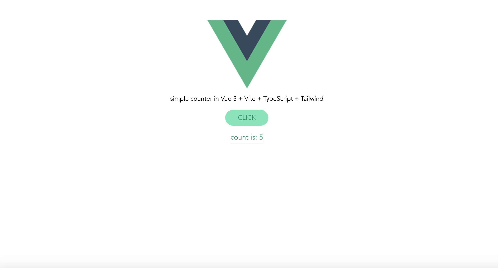

##  a simple starter for [Vue 3](https://v3.vuejs.org/) with [Vite](https://vitejs.dev/), [TypeScript](https://www.typescriptlang.org/docs/) & [Tailwind CSS](https://tailwindcss.com/docs)  

- includes the standard counter demo of the Vite starter in [Composition API](https://v3.vuejs.org/guide/composition-api-introduction.html) style

<kbd>

</kbd>

<hr>
<br>

## DIY steps:

- *must-have: Vite requires Node.js version >=12.0.0. and Tailwind requires Node.js >=12.13.0*

<br>

1. start vite project with vue template & TS *([guide here](https://github.com/vitejs/vite/tree/main/packages/create-app))*
```
$ npm init @vitejs/app my-vue-app --template vue-ts
$ cd vue3-starter
$ npm install
```

*\*can `npm` or `yarn`*

2. add Tailwind CSS *([excellent official guide here](https://tailwindcss.com/docs/guides/vue-3-vite))*

```
$ npm install -D tailwindcss@npm:@tailwindcss/postcss7-compat @tailwindcss/postcss7-compat postcss@^7 autoprefixer@^9
```
*(because Vue 3 and Vite don't support PostCSS 8 yet)*

- create the config files with:

```
$ npx tailwindcss init -p
```

this creates `tailwind.config.js` and `postcss.config.js`

- in `tailwind.config.js` add the purge configuration for tree-shaking of unused styles

```
purge: ['./index.html', './src/**/*.{vue,js,ts,jsx,tsx}'],
```

- include Tailwind in your CSS in `./src/index.css`
```
/*! @import */
@tailwind base;
@tailwind components;
@tailwind utilities;
```
- include `index.css` in `main.ts`
```
import './index.css'
```

3. serve!
```
$ npm run dev
```

## 🥳

<hr>

### next to-dos:

- [Tailwind configuration](https://tailwindcss.com/docs/configuration)
